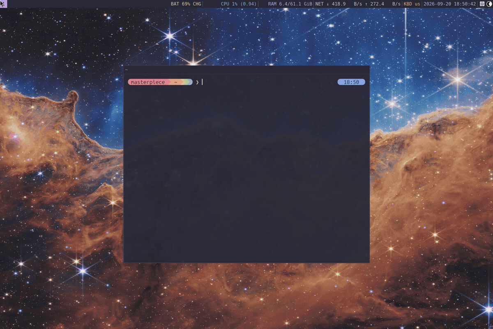

# Layouter

**Create, don't correct; preserve, don't prune.**

Layouter turns a TOML or React/TSX workflow into a running Linux development
workspace. Declare your editor, browser, terminal tabs, and panes; Layouter
inspects i3 or Sway and kitty, then creates whatever is missing. Run it again to
restore a closed test pane while your editor and development server keep running.



## Install

You need Linux, Python 3.11+, i3 or Sway, and kitty. React/TSX workflows also
need Node.js 22+. Release executables bundle the React runtime; npm is only a
build dependency.

Install a release executable:

```sh
install -Dm755 layouter ~/.local/bin/layouter
```

Or build and install from a checkout with Python, Node.js 22+, and npm available:

```sh
make install
```

This downloads the locked npm dependencies, builds the full executable, and
installs it in `~/.local/bin`. Ensure that directory is on your `PATH`.
Override the destination with `make install PREFIX=/your/prefix`.
See [packaging](docs/packaging.md) for wheels, Debian packages, and release builds.

## Turn a project into a workspace

Save this as `.dev/morning.toml` in your project:

```toml
session = "morning-{project}-{microfrontend}"
focus = "code"

[args]
microfrontend = { position = 0, required = true }

[[workspace]]
name = "code"
layout = "splith"

  [[workspace.window]]
  name = "editor"
  command = ["zed", "."]

  [[workspace.kitty]]
  name = "tools"
  layout = "tall"

    [[workspace.kitty.pane]]
    title = "server"
    command = ["npm", "run", "dev", "--", "--mf", "{microfrontend}"]

    [[workspace.kitty.pane]]
    title = "tests"
    command = ["npm", "test", "--", "--watch"]

[[workspace]]
name = "browser"

  [[workspace.window]]
  name = "browser"
  command = ["firefox", "--new-window", "http://{microfrontend}.localhost:5173"]
```

Adapt the commands to your project, then validate and launch:

```sh
layouter --check morning garden
layouter morning garden
```

Here, `morning` is the workflow filename and `garden` is the value of its
`microfrontend` argument. These are names you choose for your work.

One command opens your tools, arranges the workspaces, and focuses your editor.
Kitty remote control is configured automatically. Repeating the command fills
in missing pieces without moving existing windows or restarting processes.
Use `layouter --sync morning garden` when you want to restore the declared arrangement too.

## Build workflows around the way you work

- **Share a setup across projects.** Put workflows in `~/.config/layouter/`
  and launch with `layouter -C ~/src/garden morning garden`. Project-local `.dev/` files
  take precedence. Name a workflow `default` to launch it with just `layouter`.
- **Parameterize your environment.** Declare workflow arguments for a service,
  branch, or environment, then launch with a command such as
  `layouter morning garden`. See the [complete example](examples/morning.toml).
- **Compose layouts with React.** Reuse components and choose layouts from
  arguments and connected displays. TSX compiles to the same desired state as
  TOML and uses the same reconciliation engine.
- **Keep a layout you arranged by hand.** Use `layouter --save-layout morning garden`
  to save a TOML workflow's current arrangement, or `layouter --capture` to
  draft a new workflow from your desktop.

A React workflow can adapt its layout to the current display. Save as
`.dev/evening.tsx`, then run `layouter evening`:

```tsx
import {
  defineWorkflow, Workflow, Workspace, Window, Kitty, Pane, useScreen,
} from '@layouter/react';

export default defineWorkflow({
  component() {
    const { width } = useScreen();
    return <Workflow session="evening-{project}">
      <Workspace name="code" layout={width >= 1920 ? 'splith' : 'splitv'}>
        <Window name="editor" command={['zed', '.']} />
        <Kitty name="tools">
          <Pane name="server" command={['npm', 'run', 'dev']} />
          <Pane name="shell" />
        </Kitty>
      </Workspace>
    </Workflow>;
  },
});
```

## Go deeper

- [Workflow reference](docs/workflows.md): arguments, nested layouts, displays,
  floating windows, kitty tabs and panes, capture, and CLI options.
- [React workflows](docs/react-workflows.md): components, hooks, editor setup,
  and executable configuration behavior.
- [Design](docs/design.md): identity, desired state, and reconciliation.
- [Packaging](docs/packaging.md) and [validation](docs/validation.md): release
  artifacts, automated checks, and desktop testing.

## Development

`make release` installs build dependencies in an isolated Python environment,
loads locked npm dependencies, runs the Python and React checks, and builds and
verifies the release artifacts in `dist/`. It requires Python 3.11+ with venv
support, Node.js 22+, npm, and `dpkg-deb`.

Use `make build` for the executable and source archive, `make test` for Python
tests, and `make check` to validate the example. Run `make help` for all targets.

Layouter is available under the [MIT License](LICENSE).
